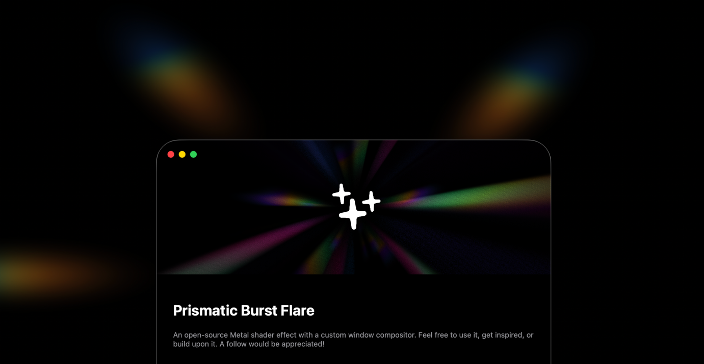

# Prismatic Flare

A Metal-based visual effects system for macOS that creates dynamic spectral rendering in two distinct modes: an animated prismatic burst that renders inside application windows, and an anamorphic lens flare effect that renders on the desktop background layer beneath all windows.

## Technical Overview

Prismatic Flare is an unsandboxed macOS application built with SwiftUI and Metal shaders. The application operates at the system level to provide immersive visual effects that interact with both the application window space and the underlying desktop environment. This project demonstrates advanced Metal shader programming techniques, real-time GPU rendering, and integration with macOS WindowServer private APIs for below-window-layer compositing.

The application leverages Metal's GPU-accelerated rendering pipeline to achieve smooth, real-time visual effects at 60 frames per second. Both rendering modes utilize custom Metal shaders that perform complex mathematical computations for ray marching, spectral color gradients, and dynamic animation systems.

## Architecture and Rendering

The visual effects system is built around two primary Metal shader files, each serving a distinct rendering purpose within the application architecture.

**HeaderBackground.metal** implements the prismatic burst effect that renders inside the application window. This shader uses a ray-marching algorithm to create volumetric spectral rays that emanate from a central point. The implementation includes a sophisticated edge fade system using quintic smoothstep interpolation combined with layered procedural noise to create organic, natural-looking boundaries. The shader supports multiple animation modes including 2D rotation, full 3D rotation with combined axis transformations, and mouse-responsive hover effects. Color rendering is achieved through either a default spectral gradient or a user-defined color palette with up to eight custom colors. The ray pattern generation uses a combination of sinusoidal functions operating in 3D space, with optional angular combing to create discrete ray counts. The shader performs 44 ray-marching steps with dynamic step length calculations based on distance from origin and procedural noise jittering.

**AnamorphicFlare.metal** implements the desktop background lens flare effect that renders below all application windows. This shader creates six animated oval-shaped spectral flares that burst outward from the center of the tracked window position. Each oval follows an independent animation timeline with randomized offsets and speed variations to create organic, non-repetitive motion. The flares use a rotated coordinate system to create elongated shapes that expand as they move outward, simulating the characteristic anamorphic lens flare aesthetic. The color system employs a five-stop gradient transitioning from deep blue through cyan and green to yellow and orange, with the gradient shifting toward warmer tones as each flare progresses through its lifecycle. The shader implements a sophisticated intensity curve that creates a "last breath" effect where flares brighten slightly before fading out completely. All flares are rendered with proper alpha blending to composite transparently over the desktop background.

## How It Works

The prismatic burst header effect operates through a ray-marching rendering technique. For each pixel on the screen, the shader casts a ray from the camera through that pixel into a virtual 3D scene. The algorithm marches along each ray in discrete steps, evaluating a procedural pattern function at each step to determine ray intensity and color. The pattern function combines multiple sinusoidal waves operating on rotated 3D coordinates to create the characteristic radiating structure. Distortion is applied through dynamic rotation of the coordinate space based on additional sine waves that vary with time and position. The layered noise system adds high-frequency detail by sampling procedural hash functions at multiple octaves with decreasing amplitude. The final color for each pixel accumulates contributions from all ray-marching steps, weighted by the spectral gradient and various falloff functions.

The anamorphic flare desktop effect uses a fundamentally different rendering approach based on geometric shapes rather than volumetric ray marching. The shader generates six separate oval primitives, each positioned at a calculated distance and angle from the window center. For each pixel, the shader transforms the coordinate system to align with each oval's orientation, then applies anisotropic scaling to create the elongated shape. Distance calculations in this transformed space determine whether the pixel falls within the oval's influence. The gradient system evaluates the horizontal position within each oval to determine which color stops to blend. The entire effect is synchronized with the main application window through a coordinate tracking system that continuously monitors the window's screen position and updates the shader's light position uniform accordingly.

Both shaders integrate with the application through Metal's rendering pipeline. The SwiftUI views create MTKView instances that manage the Metal device and command queue. Coordinator objects implement the MTKViewDelegate protocol to handle frame updates, where they populate uniform buffers with current state including time, resolution, animation parameters, and tracked positions. The Metal command buffers encode render commands with the appropriate pipeline states, vertex buffers, and fragment uniforms, then present the drawable to the screen. The prismatic burst renders into the application's content view with additive blending for bright, glowing effects. The anamorphic flare renders into a full-screen transparent overlay window positioned at the desktop window level through CGWindowLevelForKey, allowing it to appear behind all normal application windows while still being managed by the application.

## Setup Requirements

This project requires Xcode 13.0 or later and macOS 12.0 (Monterey) or later. The application uses Metal for GPU rendering, so a Metal-compatible Mac is required. The visual effects are optimized for Retina displays and run at 60 frames per second on modern Apple silicon and Intel Macs with dedicated graphics.

Before running the project, you must configure the Signing and Capabilities settings in Xcode. This is a critical step because the application operates in unsandboxed mode to access system-level APIs. Open the project in Xcode and select the Nebula target. Navigate to the Signing and Capabilities tab. In the Signing section, select your development team from the Team dropdown menu. If you do not have a team configured, you will need to add your Apple ID in Xcode preferences under Accounts. Next, update the Bundle Identifier to a unique identifier, typically using reverse domain notation such as com.yourname.nebula. This step is necessary because the default bundle identifier may conflict with other projects.

The application must run without the App Sandbox enabled. In the Signing and Capabilities tab, if you see an App Sandbox capability listed, you must remove it or ensure it is disabled. The anamorphic flare effect requires access to WindowServer private APIs and the ability to create windows at the desktop level, which is not permitted within the App Sandbox restrictions. Running the application sandboxed will prevent the desktop background effect from rendering correctly.

The application requires Screen Recording permissions to capture window positions and display the desktop-level flare effect. When you first run the application, macOS will prompt you to grant Screen Recording permission. You must allow this permission in System Preferences under Security and Privacy in the Screen Recording section. If you accidentally deny the permission, you can manually enable it by opening System Preferences, navigating to Security and Privacy, selecting the Privacy tab, clicking Screen Recording in the sidebar, and checking the box next to the Nebula application.

## Running the Project

Open the Nebula.xcodeproj file located in the src directory. Once Xcode loads the project, ensure the Nebula scheme is selected in the scheme selector at the top of the Xcode window. Verify that your Mac is selected as the run destination rather than a simulator, as Metal rendering requires actual GPU hardware. Configure the Signing and Capabilities as described in the Setup Requirements section above, ensuring your development team is selected, the bundle identifier is updated, and App Sandbox is disabled.

Build and run the project by clicking the Run button in Xcode or pressing Command-R. The application will launch and display a splash screen with the animated prismatic burst header effect. You will immediately see the ray-marched spectral effect rendering in the header area of the application window.

To activate the desktop background anamorphic flare effect, you need to enable the overlay system. The application includes hotkey support for toggling the desktop effect. Press Command-Shift-F to enable the anamorphic lens flare overlay. Once enabled, you should see six colorful oval flares emanating from the center of the application window, rendered on the desktop background behind all windows. You can move the application window around the screen and observe how the flare effect follows the window's position. To disable the overlay effect, press the Escape key or press Command-Shift-F again to toggle it off.

If the desktop flare effect does not appear, verify that you granted Screen Recording permissions and that the application is running unsandboxed. Check the Xcode console for any debug messages that might indicate permission or rendering issues.

## In Development

This project is under active development and there are several known issues and planned features that will be addressed in future updates.

**Window Tracking and Movement:** The current window tracking system has some performance limitations when rapidly moving the application window across the screen. The shader position updates can lag behind the actual window position, causing the desktop flare effect to appear slightly offset during fast movements. Future updates will implement a more efficient tracking mechanism with predictive positioning to ensure smooth, synchronized movement between the window and the background effect.

**Multiple Display Support:** The overlay rendering system currently only supports the display where the application was initially launched. When moving the application window to a secondary monitor, the desktop flare effect remains on the original screen rather than following the window to the new display. This limitation stems from the overlay window being initialized with a single screen's frame. A planned update will implement dynamic screen detection and overlay window migration to properly support multi-monitor setups.

**Focus and Positioning Issues:** There is a known positioning error that occurs when the application loses focus or when clicking outside the application window. The coordinate tracking system can report incorrect window positions during these focus change events, causing the desktop flare to jump or render at the wrong location temporarily. This will be fixed by improving the window tracking logic to handle focus changes and inactive window states more reliably.

**Additional Effects and Community Contributions:** The current prismatic flare effect is designed to be the first of multiple visual effects that can be rendered on the desktop background. Future development will introduce a dropdown menu system that allows users to select different effects to display. The community is welcome and encouraged to contribute new effects by implementing additional Metal shaders following the existing architecture. The effect selection system will make it easy to switch between different visual styles, with the prismatic burst flare serving as the initial reference implementation for other contributors to build upon.

## License

This project is open source and available under the MIT License. See the LICENSE file for more information.
